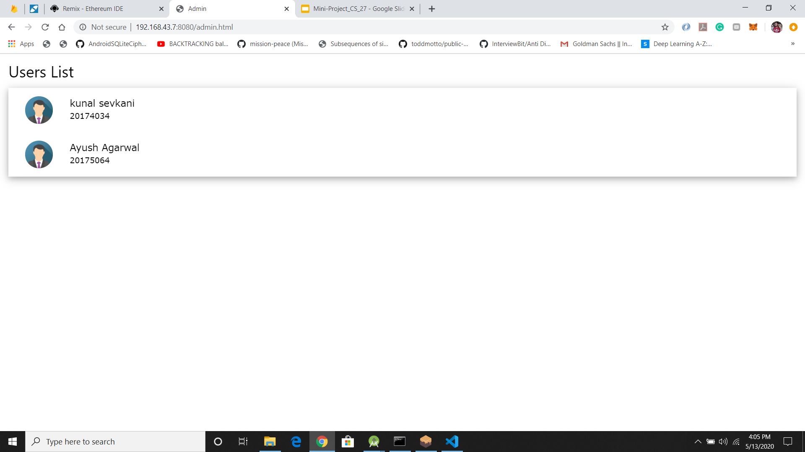
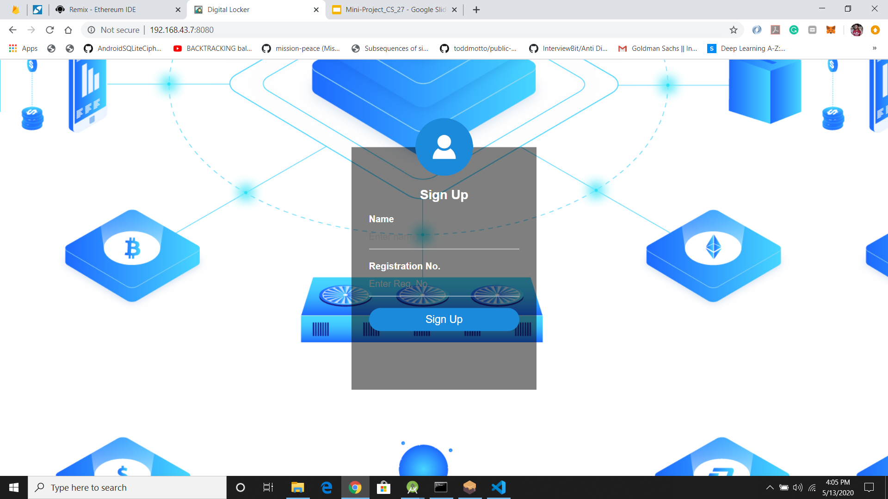
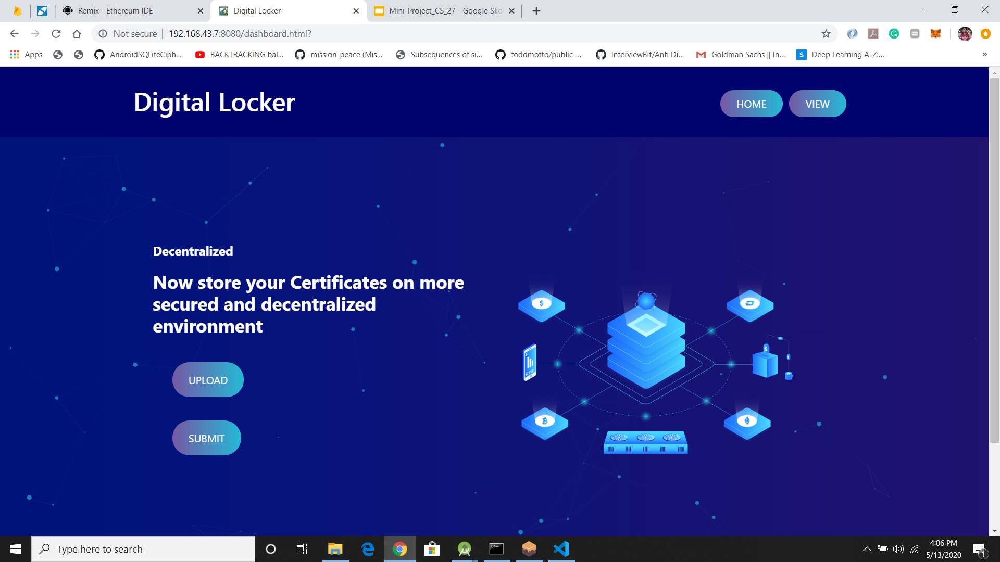
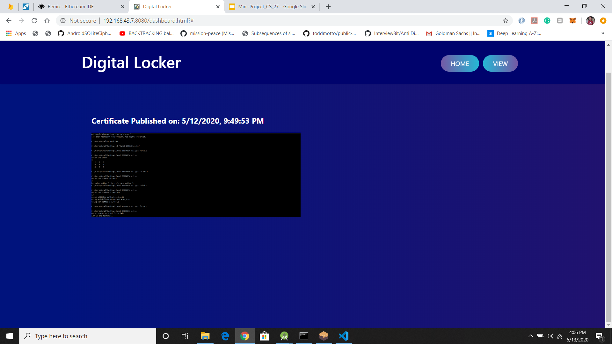

# Digital-Locker-with-Blockchain
This is Ethereum powered Dapp for storing and sharing documents with access rights

## How to Run
1. Install Ganache-cli,Metamask,node js.
2. Deploy contract in contracts folder on Remix IDE.
3. Copy ABI and Address of DigitalLocker.sol in index.html and admin.html
4. Copy ABI and Address of Document.sol in certificate.js.
5. Install http-server using npm install -g http-server.
6. Run 127.0.0.1:8080

## Screenshots

